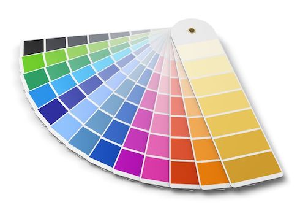

# iOS-RGBA &nbsp;[](https://travis-ci.org/emoji-gen/ios-rgba) [](http://cocoapods.org/pods/RGBA) [](http://cocoapods.org/pods/RGBA) [](http://cocoapods.org/pods/RGBA)

:art: RGBA color string utilities for iOS



## Getting Started

RGBA is available through [CocoaPods](http://cocoapods.org). To install
it, simply add the following line to your Podfile:

```ruby
pod 'RGBA'
```

### Objective-C

```obj-c
@import RGBA;

// UIColor to RGBA
UIColor *color1 = [UIColor colorWithRed:1 green:0 blue:0 alpha:1];
NSString *string1 = [RGBAUtils fromUIColor:color1];
NSString *string2 = [color1 toRGBA]; // Use category

// RGBA to UIColor
UIColor *color2 = [RGBAUtils toUIColor:@"#FF0000FF"];
UIColor *color3 = [@"#FF0000FF" RGBAtoUIColor]; // Use category
```

### Swift

```swift
import RGBA

// UIColor to RGBA
let color1 = UIColor(red: 1.0, green: 0.0, blue: 0.0, alpha: 1.0)
let string1 = RGBAUtils.fromUIColor(color1)
let string2 = color1.toRGBA() // Use Extension

// RGBA to UIColor
let color2 = RGBAUtils.toUIColor("#FF0000FF")
let color3 = "#FF0000FF".RGBAToUIColor() // Use Extension
```

## License

MIT &copy; [Emoji Generator](https://emoji.pine.moe)
